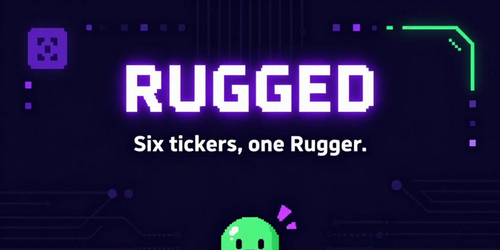
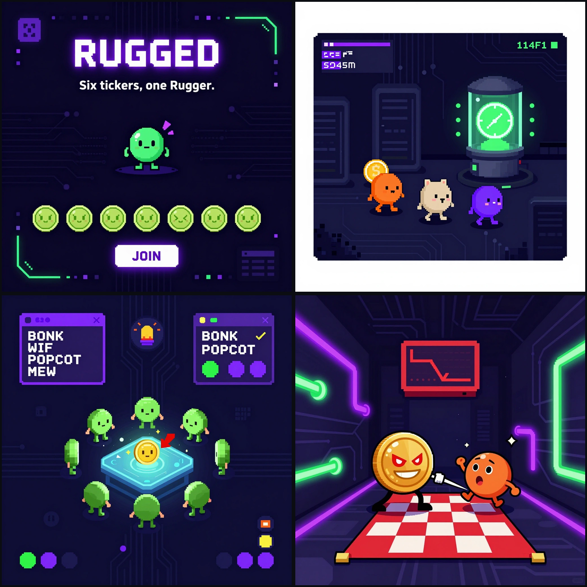
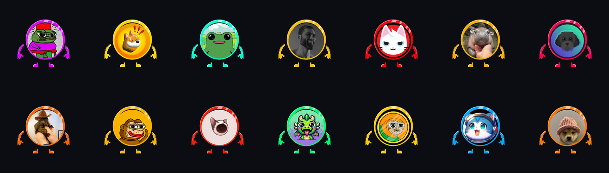

# Rugged

Social deduction on Solana. Built in one day for the MagicBlock Solana
Blitz V7 hackathon.

## Pitch

Four to six players join a lobby, each under a unique 3-5 character
memecoin ticker. One of them, secretly, is the Rugger. The crew moves
tile by tile through the map, calls meetings, and votes out whoever they
think is about to rug the project. The Rugger kills adjacent players on
a cooldown and tries to reach parity before the crew catches on. The
twist: not even the chain knows who the Rugger is. Role assignment posts
only a hash of `role || salt`, so the role sits hidden until reveal, even
from someone reading every account on chain. The production design goes
further and puts that role inside a TEE-backed Private Ephemeral Rollup,
so no party, not even the validator operator, ever sees the plaintext
role. The hackathon build ships commit-reveal, the achievable slice of
that guarantee in a day, and documents the TEE path as the next step.
Every move, kill, and vote runs on a MagicBlock Ephemeral Rollup at
10-50ms latency; the game settles back to Solana base layer only at
lobby join, delegation, and game end.

## Screenshots



Clockwise from top left: the lobby (join under a ticker, six slots
fill), a gameplay room (crew tile-walking near the reactor), the rug
moment (Rugger cornering a crewmate), and a meeting vote (crew calling
out suspects).

## Coin lineup



Every player wears a real Solana memecoin as their avatar, pulled from
on-chain token metadata. Fourteen tickers ship in `assets/tokens/coins/`;
a game picks six to eight per lobby.

## Architecture

```
                    BASE LAYER (Solana devnet)
   ┌──────────────────────────────────────────────────────┐
   │  initialize_game   join x4-6   assign_roles           │
   │  (hash(role||salt) committed, one player marked        │
   │   Rugger index via VRF — see Design notes)             │
   │                                                        │
   │  Game PDA, Player PDAs  ──────────┐                    │
   └────────────────────────────────────┼──────────────────┘
                                         │ delegate
                                         ▼
                    EPHEMERAL ROLLUP (MagicBlock, ~10-50ms)
   ┌──────────────────────────────────────────────────────┐
   │  move_player   rug   call_meeting   vote               │
   │  resolve_meeting (slash)                                │
   │                                                        │
   │  Game PDA, Player PDAs (delegated copies)               │
   └────────────────────────────────────┼──────────────────┘
                                         │ end_game: commit + undelegate
                                         ▼
                    BASE LAYER (Solana devnet)
   ┌──────────────────────────────────────────────────────┐
   │  final state committed, roles revealed, accounts        │
   │  undelegated back to the base program                   │
   └──────────────────────────────────────────────────────┘
```

What's delegated: the `Game` account and every `Player` account move to
the ER at `delegate` and stay there for the whole play phase. Nothing
else delegates. Lobby setup and role assignment run on base layer because
they happen once per game and don't need ER latency; gameplay runs on
the ER because every move, kill, and vote does.

## Repo layout

```
programs/rugged/       Anchor program: instructions, accounts, errors
programs-core/         Shared game logic (room graph, vote tally, role pick)
app/                   Vite + TypeScript client, dual-connection (base + ER)
flake.nix              Nix dev shell + cargo-check flake check
Anchor.toml            Anchor workspace config
assets/                Concept art, sprites, music, sfx, montages
docs/demo-script.md    Shot-by-shot script for the demo video
docs/submission.md     Hackathon submission form copy
docs/checklist.md      Pre-record and submission runbook
```

## How to run

Everything builds and checks through Nix; never call `cargo` or `npm`
directly.

```
nix develop                  # dev shell: rustc, cargo, nodejs, solana/anchor
nix flake check              # cargo check over the workspace (crane)
```

Solana CLI and Anchor CLI (`avm`) install per MagicBlock's own setup
docs; they aren't reliably packaged in nixpkgs, so the dev shell covers
everything `nix flake check` needs and leaves cluster tooling to your
existing install.

### Localnet

```
nix develop -c bash -c 'solana-test-validator -r &'
nix develop -c bash -c 'anchor build && anchor deploy'
```

### Devnet

`Anchor.toml` already points `[provider] cluster` at devnet. Fund a
devnet wallet, then:

```
nix develop -c bash -c 'anchor build && anchor deploy --provider.cluster devnet'
```

MagicBlock's devnet ER endpoint is `https://devnet.magicblock.app/`
(`app/.env.example` has the exact keys the client reads).

### Client dev server

```
cp app/.env.example app/.env
nix develop -c bash -c 'cd app && npm install && npm run dev'
```

`npm run typecheck` runs the same way for a type-only check without a
full build.

## Demo flow walkthrough

1. **Join** — six browser tabs each call `join` with a distinct ticker
   (`$RUG`, `$MOON`, `$WAGMI`, …) on base layer. Lobby fills at six.
2. **Role assignment** — `assign_roles` fires, VRF (or the slot-derived
   placeholder, see Design notes) picks the Rugger index, and the
   program posts `hash(role || salt)` for every player. No client, no
   observer, can read a role from the chain at this point.
3. **Delegate** — the `Game` account and all `Player` accounts delegate
   to the Ephemeral Rollup. The client switches its write connection to
   the ER.
4. **Movement** — players tile-walk between Turbine, Proof of History,
   Gossip, and Gulf Stream. Moves land in under 50ms; the UI shows
   position updates live across tabs.
5. **Rug** — the Rugger tab, in the same room as a crew member, calls
   `rug`. The target's tab shows an elimination screen. Cooldown starts.
6. **Meeting** — a surviving player calls `call_meeting`. All tabs drop
   into the vote UI.
7. **Vote** — each surviving player calls `vote` for a suspect (or
   skip).
8. **Slash** — `resolve_meeting` tallies votes and eliminates the
   plurality target. If it's the Rugger, crew wins immediately; if crew
   parity is reached first, Rugger wins.
9. **Win screen + settle** — `end_game` reveals the salted role, commits
   final state, and undelegates every account back to base layer. The
   win screen shows the revealed role next to the hash committed in
   step 2, so the audience can verify it matches.

## Design notes / MVP scope

- **Hidden roles**: commit-reveal for the hackathon build. `assign_roles`
  posts `hash(role || salt)` on base layer at lobby close and reveals it
  at `end_game`. This hides the role from anyone reading chain state
  during play, which is the property the pitch leans on. The production
  design swaps this for a TEE-backed Private Ephemeral Rollup: delegate a
  permission account alongside `Game`/`Player` so only the Rugger's own
  client can ever decrypt its role, closing the one gap commit-reveal
  leaves open (the program authority technically knows the salt at
  assignment time). Not built here; documented as the upgrade path.
- **Randomness**: `assign_roles` derives the Rugger index from the
  current slot as a placeholder (marked `TODO` in
  `programs/rugged/src/lib.rs`). Swapping in MagicBlock VRF (request +
  callback) is the next step once the request/callback plumbing is
  wired to the ER connection.
- **Vote tally**: `resolve_meeting` takes a single `slashed` target
  chosen off-chain from client-aggregated votes, rather than iterating
  every `Player` account on-chain. A production version passes all
  player accounts via `remaining_accounts` and tallies on-chain.
- **Map**: four fixed rooms (Turbine, Proof of History, Gossip, Gulf
  Stream) with adjacency checked as "same room only," no room graph yet.

## Hackathon submission notes (Solana Blitz V7)

- **Ephemeral Rollup required**: yes. `Game` and `Player` accounts
  delegate to the ER at lobby close and every gameplay instruction
  (`move_player`, `rug`, `call_meeting`, `vote`, `resolve_meeting`) runs
  there; `end_game` commits and undelegates.
- **Randomness (VRF / commit-reveal)**: yes, two layers. Role hiding uses
  commit-reveal (`hash(role || salt)`); Rugger selection is slot-derived
  today with MagicBlock VRF as the marked next step (see Design notes).
- **TEE design note**: not built. Documented above as the production
  upgrade from commit-reveal to a TEE-backed Private Ephemeral Rollup,
  which removes the one trust assumption commit-reveal still carries
  (the program authority sees the salt at assignment time).

## Program instructions

`initialize_game`, `join`, `assign_roles`, `delegate`, `move_player`,
`rug`, `call_meeting`, `vote`, `resolve_meeting`, `end_game`.

## Deliverables

Copy-paste sources: `docs/submission.md` (form text), `docs/demo-script.md`
(shot list), `docs/checklist.md` (runbook). Fill in each placeholder
before the submission deadline.

| Deliverable | Status | Link / ID |
| --- | --- | --- |
| Repository | Ready | https://github.com/jemilsson/rugged |
| Live demo | Pending first deploy | https://rugged-game.fly.dev |
| Demo video | Not recorded | PLACEHOLDER — see `docs/demo-script.md` |
| Program ID (devnet) | Not deployed | PLACEHOLDER — see `docs/submission.md` |

## License

MIT. See `LICENSE`.
